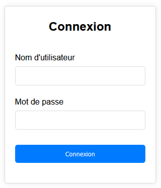
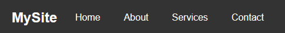
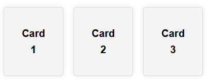

# HTMLBuilder Library


La bibliothèque `HTMLBuilder` est un outil JavaScript léger conçu pour faciliter la création et la manipulation dynamiques de contenu HTML. Elle permet aux développeurs de construire des structures HTML complexes en utilisant une syntaxe concise et orientée objet, tout en offrant une gestion fluide des styles CSS et des événements. Il s'agit d'un POC, plus d'un vrai outil !

## Fonctionnalités

- **Construction dynamique d'HTML** : Créer des éléments HTML en utilisant des méthodes chaînées pour une lisibilité et une maintenance améliorées.
- **Gestion des styles CSS** : Appliquer des styles directement via des méthodes chaînées pour chaque propriété CSS.
- **Manipulation des événements** : Ajouter facilement des gestionnaires d'événements à vos éléments.
- **Support étendu des attributs HTML** : Gérer tous les attributs HTML courants via des méthodes simplifiées.
- **Flexibilité avec les classes CSS** : Ajouter, supprimer ou basculer les classes CSS de manière intuitive.
- **Taille du fichier** : Le fichier htmlbuilder.min.js pèse à peine 3 ko.

## Installation

Inclure simplement le script `HTMLBuilder.js` dans votre projet HTML :

```html
<script src="path/to/HTMLBuilder.js"></script>
```

## Utilisation

Création d'un élément simple

```js
let div = element("div").id("main").bg("#f8f9fa").text("Hello World").build();
document.body.appendChild(div);
```

## Création d'un formulaire

```js
let loginForm = form()
  .d("flex")
  .fd("column")
  .w("300px")
  .mg("50px auto")
  .pd("20px")
  .bo("1px solid #ddd")
  .br("5px")
  .bs("0 0 10px rgba(0, 0, 0, 0.1)")
  .addChild(
    h2().text("Connexion").fs("1.5em").mgb("20px").ta("center"),
    div()
      .mg("10px 0")
      .addChild(
        label().for("username").text("Nom d'utilisateur").d("block").mgb("5px"),
        input()
          .type("text")
          .id("username")
          .name("username")
          .w("100%")
          .pd("10px")
          .br("5px")
          .bo("1px solid #ddd")
      ),
    div()
      .mg("10px 0")
      .addChild(
        label().for("password").text("Mot de passe").d("block").mgb("5px"),
        input()
          .type("password")
          .id("password")
          .name("password")
          .w("100%")
          .pd("10px")
          .br("5px")
          .bo("1px solid #ddd")
      ),
    div()
      .mg("20px 0")
      .addChild(
        button()
          .type("submit")
          .text("Connexion")
          .w("100%")
          .pd("10px")
          .bg("#007bff")
          .cl("#fff")
          .br("5px")
          .cursor("pointer")
          .bo("none")
      )
  );
```



## Création d'un menu

```js
let headerLi = (text) =>
  li()
    .mg("0 10px")
    .addChild(
      a()
        .href("#")
        .text(text)
        .cl("#fff")
        .css("textDecoration", "none")
        .pd("5px 10px")
        .br("5px")
    );

// CREATION DU HEADER
let head = header()
  .bg("#333")
  .cl("#fff")
  .pd("10px 0")
  .addChild(
    nav()
      .aClass("navbar")
      .d("flex")
      .jc("space-between")
      .ai("center")
      .css("maxWidth", "1200px")
      .mg("0 auto")
      .pd("0 20px")
      .addChild(
        div().text("MySite").fs("1.5em").fw("bold"),
        ul()
          .aClass("nav-list")
          .d("flex")
          .css("list-style", "none")
          .addChild(
            headerLi("Home").br("2px"),
            headerLi("About"),
            headerLi("Services"),
            headerLi("Contact")
          )
      )
  );
```



## Création d'une galerie de cartes

```js
// CREATION D'UNE CARTE
let card = (child) =>
  div()
    .bg("#f4f4f4")
    .bo("1px solid #ddd")
    .br("5px")
    .pd("20px")
    .w("300px")
    .ta("center")
    .bs("0 0 10px rgba(0, 0, 0, 0.1)")
    .cursor("pointer")
    .addChild(child);

// CREATION D'UN TITRE DE CARTE
let sectionTitle = (text) => h2().mg("15px").fs("1.25em").text(text);

// CREATION D'UN P DE CARTE
let sectionP = (text) => p().mgb("15px").text(text);

// CREATION D'UN A DE CARTE
let sectionA = () =>
  a()
    .href("#")
    .cl("#333")
    .td("none")
    .pd("10px 15px")
    .bo("1px solid #333")
    .br("5px")
    .text("Learn More");

// CREATION DU CONTENEUR DE CARTES
let cardsSection = section()
  .d("flex")
  .jc("center")
  .gap("20px")
  .fw("wrap")
  .mg("0 auto")
  .pd("0 20px")
  .css("maxWidth", "400px")
  .addChild(
    card(
      sectionTitle("Card 1"),
      sectionP("This is some sample content for card 1."),
      sectionA()
    ),
    card(
      sectionTitle("Card 2"),
      sectionP("This is some sample content for card 2."),
      sectionA()
    ),
    card(
      sectionTitle("Card 3"),
      sectionP("This is some sample content for card 3."),
      sectionA()
    )
  );
```



## Documentation des Méthodes

### `element(nom_balise)`

Crée un nouvel élément HTML en spécifiant le nom de la balise.

- **Paramètres** :
  - `nom_balise` : Le nom de la balise HTML à créer (ex. 'div', 'p', 'span').

### `attr(attribut, value)`

Définit un attribut pour l'élément HTML.

- **Paramètres** :
  - `attribut` : Le nom de l'attribut à définir (ex. 'id', 'href').
  - `value` : La valeur de l'attribut.

### `css(property, value)`

Applique un style CSS à l'élément.

- **Paramètres** :
  - `property` : La propriété CSS à modifier (ex. 'color', 'margin').
  - `value` : La valeur de la propriété CSS.

### `on(eventType, handler)`

Ajoute un gestionnaire d'événements à l'élément.

- **Paramètres** :
  - `eventType` : Le type d'événement à écouter (ex. 'click', 'mouseover').
  - `handler` : La fonction à exécuter lorsque l'événement est déclenché.

### `addChild(...elements)`

Ajoute un ou plusieurs éléments enfants à l'élément courant.

- **Paramètres** :
  - `elements` : Les éléments à ajouter comme enfants.

### `build()`

Finalise la construction de l'élément et renvoie l'élément HTML construit.

### `aClass(className)`

Ajoute une classe CSS à l'élément.

- **Paramètres** :
  - `className` : Le nom de la classe à ajouter.

### `rClass(className)`

Supprime une classe CSS de l'élément.

- **Paramètres** :
  - `className` : Le nom de la classe à retirer.

### `tClass(className)`

Bascule une classe CSS sur l'élément (la retire si elle est présente, l'ajoute si elle est absente).

- **Paramètres** :
  - `className` : Le nom de la classe à basculer.

### `toggle(cssOff, cssOn)`

Ajoute un comportement de bascule pour les styles CSS à chaque clic sur l'élément.

- **Paramètres** :
  - `cssOff` : Styles à appliquer lors du premier état (format `[["property", "value"], ...]`).
  - `cssOn` : Styles à appliquer lors du second état (format `[["property", "value"], ...]`).

### `flexCenter()`

Centre l'élélement à l'aide de Flexbox (met en place `display: flex`, `justifyContent: center`, et `alignItems: center`).
